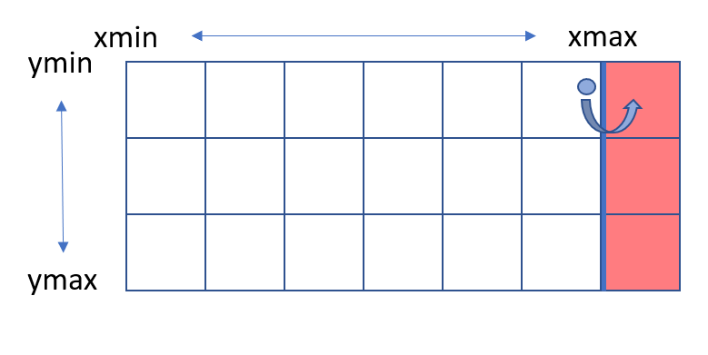

```{r setup, include=FALSE}
knitr::opts_chunk$set(echo = TRUE)
```

## Outline
I'm a **geographer by training** with interest in (Geospatial) Data Science, Geocomputation and Data Visualization.

This document elaborates on the processing of **NEXRAD hail data** from the **NOAA Severe Weather Data Inventory**.

In this analysis, only data from the year 2015 is used.

I used this data to improve my skills in spatial data processing and visualization using **mainly** the `tmap` and `raster` package.

As the code was requested, I though it would be a good chance to get into `RMarkdown`!

If you find this interesting or helpful in any way you can follow me on my **(Spatial) Data Science & Data Visualization journey (mainly R, Python, JavaScript)** also on **Twitter** ([**@chvonmatt**](https://twitter.com/chvonmatt)) or **Github** ([**@codicolus**](https://github.com/codicolus)).

## Data Sources

For this analysis and visualization I used the following datasets/data sources:

1. **NOAA Severe Weather Data Inventory**
 - Source: https://www.ncdc.noaa.gov/ncei-severe-weather-data-inventory
 - [CC0 1.0 Universal (CC0 1.0)](https://creativecommons.org/publicdomain/zero/1.0/)
2. **US States and Territories**
 - Source: https://www.weather.gov/gis/USStates
 - Metadata: https://www.weather.gov/gis/StateMetadata
3. **NEXRAD station list**
 - Source: https://www.ncdc.noaa.gov/homr/
 

**IMPORTANT:** The hail data has to be downloaded manually (or via [Kaggle](https://www.kaggle.com/noaa/severe-weather-data-inventory)).

## Folder Structure
+-- data  
|+------ raster_illustration.png
|+------ nexrad-stations.txt  
|+------ severeweatherdatainventory_2015.zip  
||+---------- hail-2015.csv  
|+------ shapefiles  
||+---------- s_11au16.zip  
|||+-------------- s_11au16.shp  
|||+-------------- s_11au16.dbf  
|||+-------------- s_11au16.prj  
|||+-------------- s_11au16.shx  
  
+-- scripts  
|+------ analysing_haildata_using_tmap.Rmd  
  
+-- output  
|+------ figures

## Data Analysis / Manipulation

### Setup
First, we have to set-up our R-environment. Here, this includes mainly loading our required libraries.

The `tidyverse` and `lubridate` packages are mainly used for the data manipulation.
The `sf` package is used for spatial data reading and manipulation.
Data visualizations are conducted using the `tmap` package (and later also the `ggplot2` package as alternative approach).

```{r settings, message=FALSE, warning=FALSE}
# deactivating scientific notation
options(scipen=999)

# libraries
libs <- c("tidyverse", "lubridate", "sf", "tmap", "raster", "janitor", "rgdal")

# check if libraries are available
pkgs_available <- libs %in% installed.packages()
if(!all(pkgs_available)){
  print("Following packages need to be installed first:")
  print(libs[!pkgs_available])
}

# load packages
invisible(lapply(libs, library, character.only=TRUE))
```

### Loading data
In this section we load both the NEXRAD hail data and also the US-States shapefile (see Section **Data Sources**).  
The downloaded files are zipped. Thus, if not already done, we first extract/unzip the data.  
From the output we can see that the US-States shapefile is a `MULTIPOLYGON` and is using the [North American Datum (NAD83)](https://en.wikipedia.org/wiki/North_American_Datum).

```{r read-hail}
# Hail data - Severe Weather Data Inventory
# unzip if necessary + read-in
if(!file.exists("../data/hail-2015.csv")){
  unzip("../data/severeweatherdatainventory_2015.zip", exdir = "../data")
}

hail_data <- read_csv("../data/hail-2015.csv")
```

```{r read-states}
# US-States Shapefile
# unzip if necessary
if(!file.exists("../data/shapefiles/s_11au16.shp")){
  unzip("../data/shapefiles/s_11au16.zip", exdir = "../data/shapefiles")
}

states_sf <- st_read(dsn = "../data/shapefiles/s_11au16.shp")
```

### Data manipulation
Now, we'll tidy our data - this includes adjusting column names, creating additional variables to facilitate the subsequent data analysis and visualization and also filtering out invalid data.


#### Hail Observations
First, the hail observation dataset gets some tidying. The **probability of hail** and **probability of severe hail** (variables `prob` and `sevprob`) are defined from 0-100%. Entries containing values lower than zero (-999) should thus be filtered out. We even take it a step further and want only to include observations with a 100%-probability of hail.

Auxiliary variables are then derived mainly from the timestamp-variable (after renaming: `ymdhms`). We'll later use them to aggregate the data.


```{r hail-manip}
# clean names
hail_data <- hail_data %>% 
  janitor::clean_names()

# filter plausible data / sort out invalid data
hail_data <- hail_data %>% filter(prob >= 100 & sevprob >= 0)

# Converting ymdhms to datetime-object (lubridate-package)
# Adding auxiliary variables
hail_data <- hail_data %>% 
  rename(ymdhms = x_ztime) %>% 
  mutate(ymdhms = ymd_hms(ymdhms),
         year = year(ymdhms),
         month = month(ymdhms),
         day = day(ymdhms),
         hour = hour(ymdhms),
         minute = minute(ymdhms),
         sec = second(ymdhms))

```


Next we'll add a `season` variable. Months are categorized according to their seasonal belonging. December to February (DJF) are considered as *Winter*, March to May (MAM) as *Spring* and so on.  
As I am not fan of multiple nested `ifelse`-statements, I used an alternative approach using `coalesce`.   First, we determine the belonging to the individual seasons separately, but let them **coalesce** to the `season`-variable within the same pipe. As you see from the `ifelse`-statements, the individual columns need to be **complementary**. This means only one of the four individual seasons has a value, the others are `NA`'s.


```{r coalesce}
# add a season variable
hail_data <- hail_data %>%
  mutate(month_name = month(month, label = TRUE, abbr = FALSE, locale = "English")) %>% 
  mutate(winter = ifelse(month_name %in% c("December", "January", "February"), "Winter (DJF)", NA),
         spring = ifelse(month_name %in% c("March", "April", "May"), "Spring (MAM)", NA),
         summer = ifelse(month_name %in% c("June", "July", "August"), "Summer (JJA)", NA),
         autumn = ifelse(month_name %in% c("September", "October", "November"), "Autumn (SON)", NA)) %>% 
  mutate(autumn = as.character(autumn)) %>% 
  mutate(season = coalesce(winter, spring, summer, autumn))
```

#### US-States Shapefile

Less manipulation is needed to prepare the US-States multipolygon shapefile.  
Only renaming and the restriction to the [**Contiguous USA (CONUS)**](https://en.wikipedia.org/wiki/Contiguous_United_States) region.

```{r shp-manip}
# rename
states_sf <- states_sf %>% rename(state=STATE, state_name = NAME)

# US-State Names
state_names <- tibble(as.data.frame(states_sf)[,1:2])

# Names of contiguous US-States
contig_us <- setdiff(states_sf$state_name, c("Alaska", "Hawaii", "Puerto Rico", 
                                             "American Samoa", "Virgin Islands", 
                                             "Northern Marianas", "Guam"))

# RESTRICTION TO CONTIGUOUS USA
states_sf <- states_sf %>% filter(state_name %in% contig_us)

```

#### Coordinate Systems and Projections

The **Coordinate Reference System (CRS)** of the hail observations (point data) must be specified first. The coordinate representations are in the [**World Geodetic System (WGS84, EPSG: 4326)**](https://epsg.io/4326) as declared by the **NOAA Severe Weather Data Inventory**. In a later step we'll create an auxiliary raster to assign each hail observation to a specific raster cell (see Section **Maximum hail size and hail days**). In order to obtain a meaningful quantitative measure (e.g. to allow for a spatial comparison), we must project the hail observations into a suitable coordinate system/projection first. The main purpose is that each raster cell with a certain hail-related value represents an equally sized area. For the USA, a suitable coordinate projection is the [**US National Equal Area (EPSG: 2163)**](https://epsg.io/2163). The units of this projection are meter (m), so we'll later be able to determine the raster resolution in m (km respectively). We also project the US States multipolygon from the [**North American Datum 83 (NAD83, EPSG: 2163)**](https://epsg.io/4269) to the US National Equal Area projection.

More on how to choose a suitable projection / CRS can be read in the very informative blog post [**Choosing the right map projection**](https://source.opennews.org/articles/choosing-right-map-projection/) by **Michael Corey**.

```{r projections}
# transform hail_data to sf-object
hail_sf <- st_as_sf(hail_data, coords = c("lon", "lat"))
# set initial WGS84
hail_sf <- st_set_crs(hail_sf, 4326)
# transform to US National Equal Area
hail_sf <- hail_sf %>% st_transform(st_crs(2163))
states_usnational <- states_sf %>% st_transform(st_crs(2163))

# add transformed coordinates as columns (additionally to geometry)
transformed_coords <- st_coordinates(hail_sf)
hail_sf <- hail_sf %>% add_column(lon_transf = transformed_coords[,1], lat_transf = transformed_coords[,2])
rm(transformed_coords)
```

#### Creating an auxiliary raster

Now we create the auxiliary raster to later `rasterize` the hail observations.  
For this we use the boundary box of the US States sf-object (US National Equal Area projection) as guide. The extent is however slightly adjusted to allow for a more convenient specification of the grid cell resolution. As for the `seq`-function only positive values are valid, the coordinates must be shifted after creation (`- abs(bb[1]/1000)`). Here, `bb[1]` corresponds to the bounding-box `xmin`, `bb[2]` to `ymin`, correspondingly.  
For this analysis, a raster resolution of 25x25km (25km^2^) is chosen.

```{r auxiliary-raster}
# BOUNDING BOX US-States in US National Equal Area Projection
bb <- st_bbox(states_usnational)

# maximum extents in x,y directions (km)
(dim_x_orig <- (bb[3] - bb[1]) / 1000)
(dim_y_orig <- (bb[4] - bb[2]) / 1000)

# adjusted raster dimensions + resolution
dim_x <- 4550
dim_y <- 2850
res_km <- 25

# longitude / latitude value vectors
lon_vals <- seq(0, dim_x, res_km)  - abs(bb[1] / 1000)
lat_vals <- seq(0, dim_y, res_km)  - abs(bb[2] / 1000)
lon_vals <- lon_vals * 1000
lat_vals <- lat_vals * 1000


# Creating the auxiliary raster
aux_raster <- raster(matrix(NA, ncol = dim_x / res_km, nrow = dim_y / res_km))

# set projection
us_national_equalArea <- rgdal::make_EPSG() %>% filter(code == 2163)
projection(aux_raster) <- us_national_equalArea$prj4 # proj4-string

# set extent
extent(aux_raster) <- c(min(lon_vals), max(lon_vals), min(lat_vals), max(lat_vals))

# dimensions
aux_raster
length(lat_vals)
length(lon_vals)

```

#### Further hail data preparation

In this step, the hail data is restricted to the extent of the just created auxiliary raster.  
  
We also create a little auxiliary function here.
The auxiliary function determines the closest coordinates to the longitude/latitude value vectors. Only longitude/latitude values lower or equal than a certain point are considered, such that the hail observations are matched to the correct raster cell. This is because the longitudes/latitudes are bounding the raster-cells and thus have larger dimensions (dim + 1, **see above!**) than the raster itself. Hail observations which are closer to the upper boundary longitude/latitude would therefore get falsely matched with the subsequent raster cell and not the one they're located in!

Analogously, the last value of the longitude/latitude vectors is excluded and no valid option as there are no more raster cells after the boundary longitude/latitude values. (Though, this should not be a problem as the data is already confined to the bounding box).

```{r constrain-data}
# Restricting data to generated raster extent
hail_sf <- hail_sf %>%
  filter(lon_transf >= min(lon_vals) & lon_transf <= max(lon_vals)) %>%
  filter(lat_transf >= min(lat_vals) & lat_transf <= max(lat_vals))

```

```{r auxiliary-func}

# closest coordinates to match datapoints to raster cell
get_closest_coords <- function(value, lon_lat){
  
  #return(which.min(abs(lon_lat[which(lon_lat <= value)] - value)))
  return(which.max(lon_lat[which(lon_lat <= value)]))
}

```


```{r closest-coords}
# determine the closest corresponding raster cell for each observation
coords <- st_coordinates(hail_sf)
lon_close <- as.data.frame(coords[,1])
lat_close <- as.data.frame(coords[,2])
lon_close <- apply(lon_close, 1, get_closest_coords, lon_vals[1:length(lon_vals)-1])
lat_close <- apply(lat_close, 1, get_closest_coords, lat_vals[1:length(lat_vals)-1])

hail_sf <- hail_sf %>% add_column(lon_close = lon_close, lat_close = lat_close)
hail_sf <- hail_sf %>% mutate(lon_usnat = lon_vals[lon_close], lat_usnat = lat_vals[lat_close])

```

A short illustration of what would happen if this would not be adjusted for in the auxiliary function is provided here. The misclassification does obviously happen for every cell and not only the last - which would cause an error anyways.



### Maximum hail size and hail days

There's one step left before we get to visualize the data: Creating **meaningful quantitative variables** to visualize!  
One variable which is of interest considering hail damage is the hail size. We want to analyze how big the largest hailstones in 2015 were and where they were detected. This variable can be achieved simultaneously to rasterizing the data with the `rasterize`-function by using the `fun` argument. Also, our auxiliary raster is now used as **template** for the maximum-hailsize raster (output).

The `rasterize` function takes two columns with longitudes and latitudes. Here, the added columns with the transformed coordinates (into US National Equal Area projection) are used. As `sf` objects always have a `geometry` column, we first have to set the `geometry` to `NULL`. We replace the `hail_data` object with this "new" data-frame.

The **template** raster should have the same specifications as desired output-raster.  
We then provide the variable to rasterize - in our case the maximum hail sizes (`maxsize`). After the rasterization, every 25x25km raster cell should contain only the **largest** maximum hail sizes detected in the year 2015, thus we use `fun = max`. A more detailed reference to the `rasterize` function can be found [here](https://www.rdocumentation.org/packages/raster/versions/3.3-13/topics/rasterize).

```{r maximum-size}
# drop geometry column
hail_data <- hail_sf %>% st_set_geometry(NULL)

# rasterize and aggregate hail sizes by maximum
max_size <- rasterize(hail_data[,c("lon_transf", "lat_transf")], aux_raster, 
                      hail_data[,c("maxsize")], fun = max)

```

To calculate the hail days, days with an observation of 100%-hail probability are summed up for each raster cell. For this, we make use of some `dplyr`-magic!  
First, we group the data with all variables we want to keep. The first variables in the grouping are the auxiliary date-related variables we created in Section **Setup -> Hail Observations**. Further, we now take advantage of the previously determined raster cells, such that a specific day with a hail observation does only count **ONCE** for a specific raster cell. As we want every hail observation on one specific day to count only once, we do not sum all observations up but set the counts to one (`n = 1`).  
In a second step, we sum all hail days for each raster cell. To do so, we group the data by the raster cells (coordinates).

Similar to the maximum hail size, we then rasterize the observations. A function is not needed, as we already have determined the raster cells. Using a grouped summary results in **only one** value for each raster cell (the sum of hail days).


```{r hail-days}
# count hail days
hail_days <- hail_data %>% 
  group_by(month, day, lon_usnat, lat_usnat) %>% 
  summarize(n = 1) %>% 
  dplyr::select(-n) %>% 
  ungroup()

hail_days <- hail_days %>% group_by(lon_usnat, lat_usnat) %>% summarize(days = n()) %>% ungroup()

hail_days <- rasterize(hail_days[,1:2], aux_raster, hail_days[,3]) # function doesn't matter here

```

## Data Visualization

Yeppa! After all the hard work, it's time for visualizing the results. For this analysis we make use of the `tmap`-package. Similar to `ggplot2`, `tmap` also makes use of the [Grammar of Graphics (see Wickham, 2010)](https://www.tandfonline.com/doi/abs/10.1198/jcgs.2009.07098).  

Before we use `tmap`, one preparation related to the aesthetics is missing: masking the `max_size` and `hail_days` raster to the US States multipolygon such that only values laying on land get displayed! For this purpose, the `raster::mask()` function suits our needs.

```{r masking}
# masking maximum hail sizes + hail days
max_size_masked <- mask(x = max_size, mask = states_usnational)
hail_days_masked <- mask(x = hail_days, mask = states_usnational)

# naming the masked raster layer
names(max_size_masked) <- "Size (inches)"
names(hail_days_masked) <- "Hail Days in 2015"
```

For each visualization, the generated raster with the variables of interest and the US States multipolygon dataset is used. To visualize the raster with `tmap`, we also provide the bounding box (it's however not necessary here). Further, we set `alpha = 0` for the faces of the US States polygons. This is required as the multipolygon-layer is overlaid onto the raster-layer which would be invisible if the polygon faces weren't transparent. The `inner.margins = c(bottom, left, top, right)` argument is used to add some space at the bottom and the top of the map. If you need more detailed explanations on how to use the `tmap`-package or if you want to get started with the `tmap`-package, you may check out the [`tmap-getstarted`](https://cran.r-project.org/web/packages/tmap/vignettes/tmap-getstarted.html)-vignette! Further, also the book [**Geocomputation in R by Robin Lovelace, Jakub Nowosad and Jannes Muenchow**](https://geocompr.robinlovelace.net/) is an extremely useful resource for spatial mapping!


```{r plot-maxsize}
# mapping maximum hail sizes
map_sizes <- tm_shape(max_size_masked, bbox = bb) + 
  tm_raster(title = "Size (inches)") +
  tm_legend(legend.position = c("left", "bottom"), scale=1.2, legend.height=0.4, legend.width=0.5) +
  tm_shape(states_usnational) + 
  tm_polygons(alpha = 0, border.col = "darkgray", lwd = 1.2) +
  tm_layout(title = "Radar estimated maximum hail sizes in 2015", 
            title.size = 1.2, 
            frame = FALSE, 
            title.position = c("left", "top"),
            inner.margins = c(0.10, 0, 0.08, 0)) +
  tm_credits("Plot by Christoph von Matt / @chvonmatt \nGithub: https://github.com/codicolus \nData: NOAA Severe Weather Data Inventory", align="left", position = c(0.2, 0), size = 0.6) +
  tm_credits("Projection: US National Equal Area \nGrid resolution: 25x25km \n", align = "left",
             position = c(0.57, 0), size = 0.6)


# save map
#tmap_save(map_sizes, "./output/figures/maxhailsizes_2015.png", dpi=300)

```


```{r plot-haildays}
# mapping hail days
map_haildays <- tm_shape(hail_days_masked, bbox = bb) +
  tm_raster(title = "Number of Days") +
  tm_legend(main.title = "Hail days in 2015 (contiguous USA)", legend.position = c("left", "bottom"),
            scale=1.2, legend.height=0.4, legend.width=0.5) +
  tm_shape(states_usnational) + 
  tm_polygons(alpha = 0, border.col = "darkgray", lwd = 1.2) +
  tm_layout(title.size = 1.2, 
            frame = FALSE, 
            title.position = c("left", "top"),
            inner.margins = c(0.10, 0, 0, 0)) +
  tm_credits("Plot by Christoph von Matt / @chvonmatt \nGithub: https://github.com/codicolus \nData: NOAA Severe Weather Data Inventory", align="left", position = c(0.2, 0), size = 0.6) +
  tm_credits("Projection: US National Equal Area \nGrid resolution: 25x25km \n", align = "left",
             position = c(0.57, 0), size = 0.6)


# save map
#tmap_save(map_haildays, "./output/figures/haildays_2015.png", dpi=300)

```


## Results & Discussion

Although the main purpose of this work is to illustrate on how to analyze and visualize hail data from [**NOAA's Severe Weather Data Inventory**](https://www.ncdc.noaa.gov/ncei-severe-weather-data-inventory), I nevertheless add a short discussion of the results here.

#### Maximum hail sizes

The radar estimated maximum hail sizes for the year 2015 depict a pretty distinct spatial pattern: The largest hail sizes were detected over the Great Plains. Hail sizes up to 4 inches are mainly distributed across South Dakota, Nebraska, Colorado, Kansas and Texas. In the other states, such very large hailstones were only detected sporadically. Most observations were smaller hail sizes (up to ca. 2.5 inches). Comparatively smaller hail sizes, or few to no hail signatures, respectively,  were detected over parts of the Great Basin, the Rocky Mountains and also some coastal areas.

#### Hail days

Regions with few or no detected hail signatures are also reflected in the hail days map. The region where most hail days were registered in 2015 is again located over the Great Plains. An interesting difference is however, that there were also many hail days registered over Florida, a state which didn't stand out regarding the radar estimated maximum hail sizes.

To discuss the results, we'll also need to consider the locations of the radar sites used in this analysis. To map the NEXRAD radar sites, I had to cheat a little bit - I used [**QGIS 3**](https://www.qgis.org/en/site/) and Map-Tiles provided by the [**US Geological Survey (USGS)**](https://www.usgs.gov/).


#### Radars and hail detection

But why are the larger hail sizes and number of hail days mainly occurring over the Great Plains? And why were only few larger hail sizes detected over Florida despite the comparatively large number of hail days in 2015? And why do regions exist where (almost) no hail signatures were detected?  

We'll now briefly touch on some interesting aspects of hail research and radar meteorology.

Radars are active sensors, that means they actively transmit pulses and retrieve information by the returning signal caused by **backscattering of atmosperic targets** (precipitation targets such as raindrops or hailstones). The strength of the returning signal - how much of the signal is backscattered - depends on the particle size and the number of particles in a given sampling volume. The larger the size or the more particles, the stronger the signal. By the means of the **weather radar equation**, a variable called **reflectivity** (units: dBZ) can be obtained which in turn can be used to estimate the precipitation intensity. To determine whether hail occurs within a convective storm, modern dual-polarization radars often use a combination of the reflectivity and a variable called "differential reflectivity". For a detailed description of (dual polarization) radar variables see [Kumjian 2013a](http://nwafiles.nwas.org/jom/articles/2013/2013-JOM19/2013-JOM19.pdf) and [b](http://nwafiles.nwas.org/jom/articles/2013/2013-JOM20/2013-JOM20.pdf).  

"Classic" **hail detection algorithms**, such as the **probability of hail** (POH, `prob`, [Waldvogel et al. 1979](https://journals.ametsoc.org/jamc/article/18/12/1521/350431/Criteria-for-the-Detection-of-Hail-Cells)) use information of the **environmental freezing level height** in combination with the reflectivity variable. [Waldvogel et al. 1979](https://journals.ametsoc.org/jamc/article/18/12/1521/350431/Criteria-for-the-Detection-of-Hail-Cells) use the maximum height ("**EchoTop**") to which reflectivity values characteristic to graupel/hail (e.g. 45dBZ) extending above the environmental freezing level to estimate the probability of hail occurrence. The principle is that stronger convective storms are supposed to have stronger updrafts which are able to lift larger precipitation particles to higher heights above the freezing level and hail thus becomes more likely as the environment favorable for hail growth gets more extensive. If the retention time of hail stones in  regions favorable to hail growth is prolonged, larger hail stones can form. This is however a simplified view as other factors (e.g. amount of supercooled liquid water (liquid water at subfreezing temperatures), wind shear, etc.) also play an important role for hail growth! This would however lead too far for this short excursion presented here. If you're interested in this, please have a look at the comprehensive review **Understanding hail in the earth system** by [Allen et al. 2019](https://agupubs.onlinelibrary.wiley.com/doi/full/10.1029/2019RG000665).  

For the interested reader, the **probability of severe hail** (POSH, `sevprob`) and **maximum estimated hail size** (MEHS, `maxsize`) algorithms are described in detail in [Witt et al. 1998](https://journals.ametsoc.org/waf/article/13/2/286/38053/An-Enhanced-Hail-Detection-Algorithm-for-the-WSR).

Radars sample the entire atmosphere in a certain period of time by scanning a full 360 degree circle at different (discrete) azimuths and elevation angles. How the atmosphere is sampled depends on radar system and scanning strategy. There are however limitations in sampling the atmosphere. First, current radar systems such as the **Weather Surveillance Radar 88 Doppler (WSR-88D)** used in the **Next-Generation Radar (NEXRAD) network** are limited by a maximum elevation angle. This is not problematic when storms occur at a certain distance away from the radar site. But when convective storms or precipitation systems move too close or exactly over the radar site, the sampling height is restricted as the highest elevation angles won't reach up to the top of the atmosphere. The region where no sampling is possible due to these elevation constraints is called **cone of silence**. For more details on how radars operate, the [Radar Tutorial](https://www.radartutorial.eu/index.en.html) webpage is a helpful resource. Alternatively, the book **Radar Meteorology** by [Rauber & Nesbitt, 2018](https://www.amazon.com/Radar-Meteorology-Advancing-Weather-Climate/dp/1118432622) is highly recommended. 

Further, due to earth curvature, the lowest elevation is sampled in increasing height (above ground level) with increasing distance. At some point, no information from lower levels can be retrieved anymore. At some point downrange of the radar site, no meaningful data can be sampled anymore as the vertical resolution gets too low. The range from where meaningful information can be retrieved is mainly dependent on the **pulse repetition frequency (PRF)**. The radar pulse frequency denotes the frequency with with consecutive radar signals are transmitted. If the next signal has already been transmitted, returning signals from the previous transmission cannot be unambiguously interpreted as the returning signal cannot be associated with one specific signal transmission. In the next sampling volume (completely sampled atmosphere image), this early returning signal maybe misinterpreted as a storm located close to the radar site, when in fact the real storm is located further away. These signals are called **second trip echos**. Avoiding this misinterpretation requires a range restriction.  

Another range limitation which shall be mentioned here is shielding by topography. If a radar is for example located too close to a mountain the full potential sampling range is correspondingly limited by the distance of the topographic obstacle.

Now let's have a look at how this relates to our visualized hail data.

#### Discussion of the results

WSR-88D radar systems within the NEXRAD network have a typical long range limitation for the base reflectivity of about 460 km (286 miles, see [this NWS-page](https://www.weather.gov/iwx/wsr_88d)). Even with all radars used in this analysis, several coverage gaps exist. If we compare the coverage map provided by [NOAA](https://www.roc.noaa.gov/WSR88D/Maps.aspx) with our maps of the largest maximum hail sizes and hail days in 2015, these coverage gaps are well reflected. The regions where no hail signatures were detected over parts within the states of Nevada, Oregon and also in West Texas, are associated with coverage gaps. Coverage gaps over the Great Plains in the states of Montana and Wyoming are also depicted.

Comparing the estimated maximum hail sizes in the year 2015 with all hail size detections in **NOAA's National Centres for Environmental Information (NCEI) Severe Weather Data Inventory** shows that the maximum hail size distribution agrees well with the mean annual maximum hail sizes in the period 1979-2013 (NCEI detections, see [Allen et al. 2017, p. 4504](https://journals.ametsoc.org/mwr/article/145/11/4501/103476/An-Extreme-Value-Model-for-U-S-Hail-Size)).  
Atmospheric conditions over the Great Plains are supporting strong convection (e.g. steeper lapse rates, wind shear conditions, convective available potential energy) and supercellular storms which are responsible for considerable fraction of all large hail observations (see the [webpage on Supercell Structure and Dynamics by the NWS](https://www.weather.gov/lmk/supercell/dynamics), [Allen et al. 2017](https://journals.ametsoc.org/mwr/article/145/11/4501/103476/An-Extreme-Value-Model-for-U-S-Hail-Size), [Allen et al. 2015](https://agupubs.onlinelibrary.wiley.com/doi/full/10.1002/2014MS000397) and sources therein, as well as the climatology of several important variables for severe convection in [Taszarek et al. 2020](https://journals.ametsoc.org/bams/article/doi/10.1175/BAMS-D-20-0004.1/354591/Differing-trends-in-United-States-and-European)). Also, an older study by [Doswell III et al. 2005](https://journals.ametsoc.org/waf/article/20/4/577/38967) analyzed the hail occurrence probability over the CONUS region. Especially their severe hail distribution for hail sizes $\ge$ 2 inches matches well with the hail data in 2015 (see Figure 9 in [Doswell III et al. 2005](https://journals.ametsoc.org/waf/article/20/4/577/38967))

The counted hail days for the year 2015 are also in accordance with the US National thunderstorm frequency (see the top figure on [**this webpage**](https://climatecenter.fsu.edu/topics/thunderstorms) of the **Florida Climate Center**). A local maximum in average number of thunderstorm days is located over the Great Plains. Thunderstorms are however not necessarily hailstorms. Supporting our hot spot for the maximum estimated hail sizes as well as the maximum in hail days over and close to the Great Plains region is the annual mean number of large hail reports for the period 1979-2012 shown in [Allen et al. 2015, p. 227](https://agupubs.onlinelibrary.wiley.com/doi/full/10.1002/2014MS000397). The overall maximum of thunderstorm days in the US over Florida ([Florida Climate Center](https://climatecenter.fsu.edu/topics/thunderstorms)). But on the same page - we also learn that Florida has not that many instances of hail (see Section **Hail**).  

So why did our analysis reveal up to 30 hail days, despite there are not that many instances of hail supposed to occur over Florida?

The Florida Climate Center provides the answer:

>The freezing level in a Florida thunderstorm is so high; hail often melts before it reaches the ground.
>
> `r tufte::quote_footer('--- Florida Climate Center')`

So always remember when analyzing any kind of remote sensing data - what actually is calculated by algorithms is just an estimation/approximation of the reality! These algorithms surely are model-calibrated to existing data (e.g. real hail observations), but still - the radar estimations are not ground truth data! Verification with ground truth data is thus key - but still a challenge for local phenomena such as hail. Emerging approaches rely strongly on the public, for example crowd-sourced hail reports using mobile apps (see [Barras et al. 2019](https://journals.ametsoc.org/bams/article/100/8/1429/344781)) or storm spotter networks (see [spotternetwork.org](https://www.spotternetwork.org/)). 

Certain is, that the radar algorithm to estimate the probability of hail (POH) detected a 100% chance of hail. It is quite likely that there was hail present within the specific thunderstorms on each of the detected hail days in 2015. But we cannot know - without ground truth data - that the hailstones actually reached ground before melting. But knowing the fact, that "there are not so many hail instances" observed in Florida - we should be critical about the number of hail days detected solely by the radar hail signatures. 

## Acknowlegments

Thank you very much for reading this `RMarkdown` script!  
I hope you found it informative and useful in some way. If you have suggestions for improvement or ways how to solve a specific processing step more efficiently, please let me know! Also if something does not look right to you - suggestions for correction/improvement are welcome!

At this point, I'd like to thank and give a huge shout out to all the data providers, namely the [National Oceanic and Atmospheric Administration (NOAA)](https://www.noaa.gov/) for the **hail data and NEXRAD station list**, the [US National Weather Service (NWS)](https://www.weather.gov/) for the **US States and Territories shapefile** and the [United States Geological Survey (USGS)](https://www.usgs.gov/) for providing the **map-tiles** and **R-package creators** for their extremely valuable and helpful work to facilitate the realization of this little project.

___
#### R-Software
___

**R Core Team (2020)**. R: A language and environment for statistical computing. R Foundation for Statistical Computing, Vienna, Austria. URL https://www.R-project.org/.

___
#### R-Packages
___

`tidyverse`  
**Wickham et al. (2019)**. Welcome to the tidyverse. Journal of Open Source Software, 4(43), 1686, https://doi.org/10.21105/joss.01686

`lubridate`  
**Garrett Grolemund, Hadley Wickham (2011)**. Dates and Times Made Easy with lubridate. Journal of Statistical Software, 40(3), 1-25. http://www.jstatsoft.org/v40/i03/.

`sf`  
**Pebesma, E. (2018)**. Simple Features for R: Standardized Support for Spatial Vector Data. The R Journal 10 (1), 439-446, https://doi.org/10.32614/RJ-2018-009

`tmap`  
**Tennekes M (2018)**. tmap: Thematic Maps in R. Journal of Statistical Software, 84(6), 1-39. doi: 10.18637/jss.v084.i06 (URL: https://doi.org/10.18637/jss.v084.i06).

`raster`  
Robert J. Hijmans **(2020)**. raster: Geographic Data Analysis and Modeling. R package version 3.3-13. https://CRAN.R-project.org/package=raster

`janitor`  
Sam Firke **(2020)**. janitor: Simple Tools for Examining and Cleaning Dirty Data. R package version 2.0.1. https://CRAN.R-project.org/package=janitor

`rgdal`  
**Roger Bivand, Tim Keitt and Barry Rowlingson (2019)**. rgdal: Bindings for the 'Geospatial' Data Abstraction Library. R package version 1.4-8. https://CRAN.R-project.org/package=rgdal

___
#### Literature
___

**Allen, J.T., Giammanco, I.M., Kumjian, M.R., Punge, H.J., Zhang, Q., Groenemeijer, P., Kunz, M., Ortega, K. (2020)**. Understanding Hail in the Earth System. Reviews of Geophysics 58, https://doi.org/10.1029/2019RG000665

**Allen, J.T., Tippett, M.K., Kaheil, Y., Sobel, A.H., Lepore, C., Nong, S., Muehlbauer, A. (2017)**. An Extreme Value Model for U.S. Hail Size. Mon. Wea. Rev. 145, 4501–4519. https://doi.org/10.1175/MWR-D-17-0119.1

**Allen, J.T., Tippett, M.K., Sobel, A.H. (2015)**. An empirical model relating U.S. monthly hail occurrence to large-scale meteorological environment. Journal of Advances in Modeling Earth Systems 7, 226–243. https://doi.org/10.1002/2014MS000397

**Barras, H., Hering, A., Martynov, A., Noti, P.-A., Germann, U., Martius, O. (2019)**. Experiences with >50,000 Crowdsourced Hail Reports in Switzerland. Bull. Amer. Meteor. Soc. 100, 1429–1440. https://doi.org/10.1175/BAMS-D-18-0090.1

**Doswell, C.A., Brooks, H.E., Kay, M.P. (2005)**. Climatological Estimates of Daily Local Nontornadic Severe Thunderstorm Probability for the United States. Wea. Forecasting 20, 577–595. https://doi.org/10.1175/WAF866.1

**Kumjian, M.R. (2013a)**. Principles and Applications of Dual-Polarization Weather Radar. Part I: Description of the Polarimetric Radar Variables. Journal of Operational Meteorology 19, 226–242. http://dx.doi.org/10.15191/nwajom.2013.0119

**Kumjian, M.R. (2013b)**. Principles and Applications of Dual-Polarization Weather Radar. Part II: Warm- and Cold-Season Applications. Journal of Operational Meteorology 20, 243–264. http://dx.doi.org/10.15191/nwajom.2013.0120

**Rauber, R.M., Nesbitt, S.W. (2018)**. Radar meteorology: a first course, First edition. ed, Advancing weather and climate science series. John Wiley & Sons, Hoboken, NJ.

**Taszarek, M., Allen, J.T., Brooks, H.E., Pilguj, N., Czernecki, B. (2020)**. Differing trends in United States and European severe thunderstorm environments in a warming climate. Bull. Amer. Meteor. Soc. 1–51. https://doi.org/10.1175/BAMS-D-20-0004.1

**Waldvogel, A., Federer, B., Grimm, P. (1979)**. Criteria for the Detection of Hail Cells. J. Appl. Meteor. 18, 1521–1525. https://doi.org/10.1175/1520-0450(1979)018<1521:CFTDOH>2.0.CO;2

**Wickham, H. (2010)**. A Layered Grammar of Graphics. Journal of Computational and Graphical Statistics 19, 3–28. https://doi.org/10.1198/jcgs.2009.07098

**Witt, A., Eilts, M.D., Stumpf, G.J., Johnson, J.T., Mitchell, E.D.W., Thomas, K.W. (1998)**. An Enhanced Hail Detection Algorithm for the WSR-88D. Wea. Forecasting 13, 286–303. https://doi.org/10.1175/1520-0434(1998)013<0286:AEHDAF>2.0.CO;2
